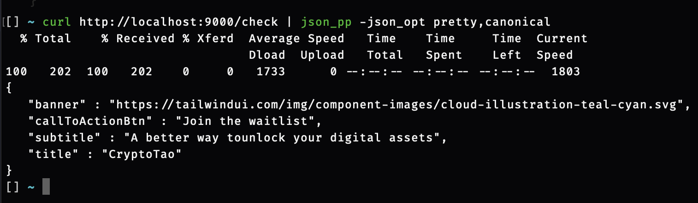

## Installation

```bash
$ npm install
```
### Running the Application (using Docker Compose)
##### !important 
You'll need both Docker and Docker Compose installed and configured globally for running the Application using this command below.
[Docker](https://docs.docker.com/get-docker/)
[Docker Compose](https://docs.docker.com/compose/install/)

```bash
  npm run start:docker
```

Now, you should be able to call the application running the following curl command:

```bash
  curl http://localhost:9000/check | json_pp -json_opt pretty
```
The following result should appear:



## Running the app (Without Docker Compose)

```bash
# development
$ npm run start

# watch mode
$ npm run start:dev

# production mode
$ npm run start:prod
```

## Test

```bash
# unit tests
$ npm run test

# e2e tests
$ npm run test:e2e

# test coverage
$ npm run test:cov
```
## License

This project has a public [GNU GENERAL PUBLIC LICENSE](LICENSE).
